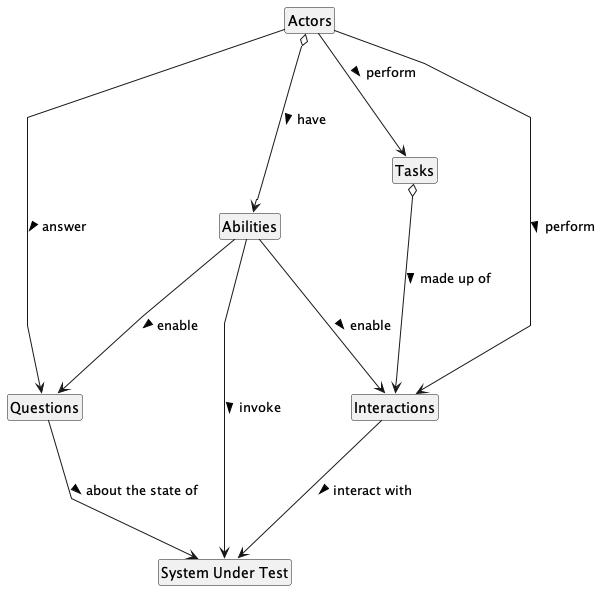

# Python Screenplay Demo

The screenplay design pattern is an innovative, user-centred approach to writing high-quality automated acceptance tests. It steers you towards an effective use of layers of abstraction, helps your test scenarios capture the business vernacular of your domain, and encourages good testing and software engineering habits on your team.

## Object Interaction Diagram

